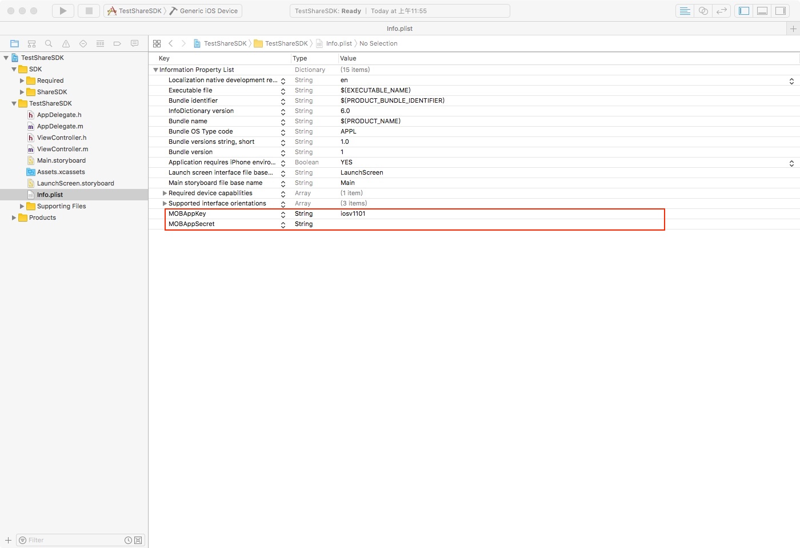
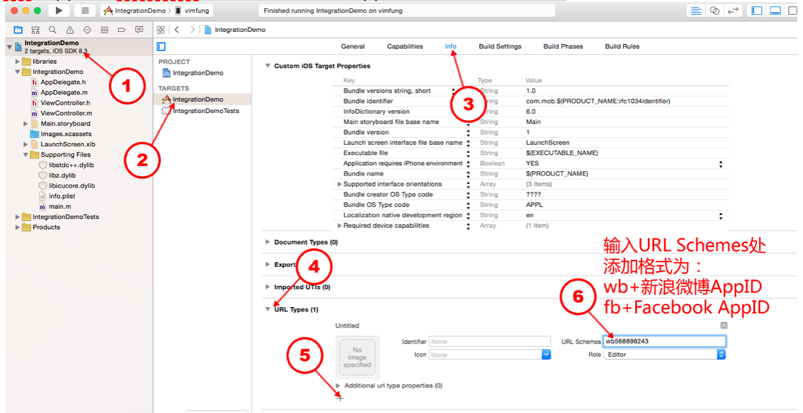

# ShareSDK For iOS
**文档语言 :** **中文** | **[English](README_EN.md)**

### 概述
>ShareSDK是一个完全免费的社会化分享组件，为移动端的iOS/Android App提供社会化功能。本组件是iOS组件，提供简单轻巧的接口，能快速实现第三方登录、获取用户信息、社会化平台分享，获取好友等功能。本组件支持国内外超过四十个主流社交平台。
>集成本组件将大大缩短开发者的开发时间。同时还提供的专业的后台统计等丰富的扩展功能，助力App的推广运营。

- - - - -

### 当前版本更新（4.2.1）

更新说明:[详情](http://bbs.mob.com/thread-25962-1-1.html)  
1. 新增FacebookAccountKit平台  
2. 新增天翼平台  
3. 调整微信和QQ平台uid策略,uid使用用户唯一标识openid, 其他数据如unionid(若存在)可从rawdata字段中获取  
4. 优化YouTube平台，平台返回401错误码区分授权错误与无频道  
5. 修复与firebase兼容问题  
6. 修复QQ平台text与title参数对调问题 


[更多版本更新说明](i_update.md)  

- - - - - 
### 一、获取AppKey
如何在我们的官网注册应用得到appkey，请点击 [链接](http://bbs.mob.com/forum.php?mod=viewthread&tid=8212&extra=page%3D1) 看里面的操作步骤。

### 二、快速集成
下面是使用Cocoapods集成方式，另一种通过官方下载相关Framework直接集成 [下载地址](http://www.mob.com/download)。
ShareSDK支持使用Cocoapods集成，请按需在Podfile文件中添加以下语句：  

```

# ============================== START ShareSDK ==============================
# 主模块(必须)
pod 'mob_sharesdk'
 
 
# UI模块(非必须，需要用到ShareSDK提供的分享菜单栏和分享编辑页面需要以下1行)
pod 'mob_sharesdk/ShareSDKUI'
 
 
# 平台SDK模块(对照一下平台，需要的加上。如果只需要QQ、微信、新浪微博，只需要以下3行)
pod 'mob_sharesdk/ShareSDKPlatforms/QQ'
pod 'mob_sharesdk/ShareSDKPlatforms/SinaWeibo'
#（微信sdk不带支付的命令）
pod 'mob_sharesdk/ShareSDKPlatforms/WeChat'   
#（微信sdk带支付的命令，和上面不带支付的不能共存，只能选择一个
# pod 'mob_sharesdk/ShareSDKPlatforms/WeChatFull'）
 
# 平台SDK模块其他平台，按需添加
pod 'mob_sharesdk/ShareSDKPlatforms/RenRen'
pod 'mob_sharesdk/ShareSDKPlatforms/AliPaySocial'
pod 'mob_sharesdk/ShareSDKPlatforms/Kakao'
pod 'mob_sharesdk/ShareSDKPlatforms/Yixin'
pod 'mob_sharesdk/ShareSDKPlatforms/Facebook'
pod 'mob_sharesdk/ShareSDKPlatforms/Messenger'
pod 'mob_sharesdk/ShareSDKPlatforms/Copy'
pod 'mob_sharesdk/ShareSDKPlatforms/Evernote'
pod 'mob_sharesdk/ShareSDKPlatforms/GooglePlus'
pod 'mob_sharesdk/ShareSDKPlatforms/Instagram'
pod 'mob_sharesdk/ShareSDKPlatforms/Instapaper'
pod 'mob_sharesdk/ShareSDKPlatforms/Line'
pod 'mob_sharesdk/ShareSDKPlatforms/Mail'
pod 'mob_sharesdk/ShareSDKPlatforms/SMS'
pod 'mob_sharesdk/ShareSDKPlatforms/WhatsApp'
pod 'mob_sharesdk/ShareSDKPlatforms/MeiPai'
pod 'mob_sharesdk/ShareSDKPlatforms/DingTalk'
pod 'mob_sharesdk/ShareSDKPlatforms/YouTube'
pod 'mob_sharesdk/ShareSDKPlatforms/Twitter'
pod 'mob_sharesdk/ShareSDKPlatforms/Dropbox'
pod 'mob_sharesdk/ShareSDKPlatforms/DingTalk'
pod 'mob_sharesdk/ShareSDKPlatforms/CMCC'
pod 'mob_sharesdk/ShareSDKPlatforms/Telegram'
pod 'mob_sharesdk/ShareSDKPlatforms/Reddit'
pod 'mob_sharesdk/ShareSDKPlatforms/DouBan'
pod 'mob_sharesdk/ShareSDKPlatforms/Flickr'
pod 'mob_sharesdk/ShareSDKPlatforms/KaiXin'
pod 'mob_sharesdk/ShareSDKPlatforms/LinkedIn'
pod 'mob_sharesdk/ShareSDKPlatforms/MingDao'
pod 'mob_sharesdk/ShareSDKPlatforms/Pinterest'
pod 'mob_sharesdk/ShareSDKPlatforms/Pocket'
pod 'mob_sharesdk/ShareSDKPlatforms/Print'
pod 'mob_sharesdk/ShareSDKPlatforms/TencentWeibo'
pod 'mob_sharesdk/ShareSDKPlatforms/Tumblr'
pod 'mob_sharesdk/ShareSDKPlatforms/VKontakte'
pod 'mob_sharesdk/ShareSDKPlatforms/YouDaoNote'
pod 'mob_sharesdk/ShareSDKPlatforms/ESurfing'
pod 'mob_sharesdk/ShareSDKPlatforms/FacebookAccount'
 
 
# 使用配置文件分享模块（非必需）
pod 'mob_sharesdk/ShareSDKConfigFile'
 
 
# 扩展模块（在调用可以弹出我们UI分享方法的时候是必需的）
pod 'mob_sharesdk/ShareSDKExtension'

# ============================== END ShareSDK ==============================


```

### 三、在使用pod集成过程中以下为可能出现的问题及解决方案 
>
>如果搜索不到我们的这个mob\_sharesdk时：  
>1、请先进行：pod setup  
>2、再清空一下搜索索引，让pod重建索引  
>    rm ~/Library/Caches/CocoaPods/search_index.json  
><font color=red size=3 >注意：之前的命令写法之后会慢慢废弃，建议都使用这个新的命令写法</font>
>  
><font size=3>CocoaPods的介绍和使用，可以参考：[网页链接](https://www.jianshu.com/p/c1449e8389a3)</font>  
><font size=3>如果安装过程中遇到问题，可以参考：[网页链接](http://wiki.mob.com/%E4%BD%BF%E7%94%A8-cocoapods-%E9%9B%86%E6%88%90-sharesdk-%E7%9A%84%E5%B8%B8%E8%A7%81%E9%97%AE%E9%A2%98/)</font>  
><font size=3>如果pod更新比较慢的话，可以在后面加源，需要集成的命令写法 [点击此处](http://bbs.mob.com/forum.php?mod=viewthread&tid=23432&page=1&extra=#pid56409)</font> 
>

### 四、项目中配置及如何使用ShareSDK
#### 第一步：设置ShareSDK的Appkey并初始化对应的第三方社交平台
在项目工程的Info.plist 中如图增加 MOBAppkey 和 MOBAppSecret 两个字段  
在 MOBAppkey中 设置ShareSDK的appKey，如果尚未在ShareSDK官网注册过App，请移步到登录后台进行应用注册  也可以点击链接看里面的操作步骤。  

 

>友情提示：如果您同时多个MOBSDK产品 在info.plist中的设置一次就可以了。  

**打开\*AppDelegate.m(\*代表你的工程名字)导入头文件**

```objc
#import <ShareSDK/ShareSDK.h>
```

在- (BOOL)application: didFinishLaunchingWithOptions:方法中调用registerApp方法来初始化SDK并且初始化第三方平台（各社交平台申请AppKey的网址及申请流程汇总）  

```objc
- (BOOL)application:(UIApplication *)application didFinishLaunchingWithOptions:(NSDictionary *)launchOptions
{
    [ShareSDK registPlatforms:^(SSDKRegister *platformsRegister) {
        //QQ
        [platformsRegister setupQQWithAppId:@"100371282" appkey:@"aed9b0303e3ed1e27bae87c33761161d"];
        
        //微信
        [platformsRegister setupWeChatWithAppId:@"wx617c77c82218ea2c" appSecret:@"c7253e5289986cf4c4c74d1ccc185fb1"];
        
        //新浪
        [platformsRegister setupSinaWeiboWithAppkey:@"568898243" appSecret:@"38a4f8204cc784f81f9f0daaf31e02e3" redirectUrl:@"http://www.sharesdk.cn"];
        
        //Facebook
        [platformsRegister setupFacebookWithAppkey:@"1412473428822331" appSecret:@"a42f4f3f867dc947b9ed6020c2e93558" displayName:@"shareSDK"];
        
        //Twitter
        [platformsRegister setupTwitterWithKey:@"viOnkeLpHBKs6KXV7MPpeGyzE" secret:@"NJEglQUy2rqZ9Io9FcAU9p17omFqbORknUpRrCDOK46aAbIiey" redirectUrl:@"http://mob.com"];
        //Instagram
        [platformsRegister setupInstagramWithClientId:@"ff68e3216b4f4f989121aa1c2962d058" clientSecret:@"1b2e82f110264869b3505c3fe34e31a1" redirectUrl:@"http://sharesdk.cn"];
        
        //钉钉
        [platformsRegister setupDingTalkWithAppId:@"dingoabcwtuab76wy0kyzo"];
        
        //支付宝
        [platformsRegister setupAliSocialWithAppId:@"2017062107540437"];
        
        //豆瓣
        [platformsRegister setupDouBanWithApikey:@"02e2cbe5ca06de5908a863b15e149b0b" appSecret:@"9f1e7b4f71304f2f" redirectUrl:@"http://www.sharesdk.cn"];
        
        //Dropbox
        [platformsRegister setupDropboxWithAppKey:@"us514wslpfojbxc" appSecret:@"w0nmp4os3ngo1ja" redirectUrl:@"http://localhost"];
        
        //易信
        [platformsRegister setupYiXinByAppId:@"yx0d9a9f9088ea44d78680f3274da1765f" appSecret:@"1a5bd421ae089c3" redirectUrl:@"https://open.yixin.im/resource/oauth2_callback.html"];
        //Flickr
        [platformsRegister setupFlickrWithApiKey:@"cbed81d4a1bc7417693ab7865e354717" apiSecret:@"4c490343869091f2"];
        
        //Instapaper
        [platformsRegister setupInstapaperWithConsumerKey:@"4rDJORmcOcSAZL1YpqGHRI605xUvrLbOhkJ07yO0wWrYrc61FA" consumerSecret:@"GNr1GespOQbrm8nvd7rlUsyRQsIo3boIbMguAl9gfpdL0aKZWe"];
        
        //Line
        [platformsRegister setupLineAuthType:SSDKAuthorizeTypeBoth];
        
        //YinXiang
        [platformsRegister setupEvernoteByConsumerKey:@"46131514-6903" consumerSecret:@"08d7a6f3afcc888a" sandbox:YES];
        
        //Evernote
        [platformsRegister setupEvernoteByConsumerKey:@"46131514-6903" consumerSecret:@"08d7a6f3afcc888a" sandbox:YES];
        
        //kakao
        [platformsRegister setupKaKaoWithAppkey:@"9c17eb03317e0e627ec95a400f5785fb" restApiKey:@"802e551a5048c3172fc1dedaaf40fcf1" redirectUrl:@"http://www.mob.com/oauth"];
        
        //VKontakte
        [platformsRegister setupVKontakteWithApplicationId:@"5312801" secretKey:@"ZHG2wGymmNUCRLG2r6CY" authType:SSDKAuthorizeTypeBoth];
        
        //YouTube
        [platformsRegister setupYouTubeWithClientId:@"906418427202-jinnbqal1niq4s8isbg2ofsqc5ddkcgr.apps.googleusercontent.com" clientSecret:@"" redirectUrl:@"http://localhost"];
        
        //美拍
        [platformsRegister setupMeiPaiWithAppkey:@"1089867639"];
        
        //腾讯微博
        [platformsRegister setupTencentWeiboWithAppkey:@"801307650" appSecret:@"ae36f4ee3946e1cbb98d6965b0b2ff5c" redirectUrl:@"http://www.sharesdk.cn"];
        
        //人人网
        [platformsRegister setupRenRenWithAppId:@"226427" appKey:@"fc5b8aed373c4c27a05b712acba0f8c3" secretKey:@"f29df781abdd4f49beca5a2194676ca4" authType:SSDKAuthorizeTypeBoth];
        
        //CMCC
        [platformsRegister setupCMCCByAppId:@"300011862498" appKey:@"38D9CA1CC280C5F207E2C343745D4A4B" displayUI:YES];
        
        //有道云笔记
        [platformsRegister setupYouDaoNoteWithConsumerKey:@"dcde25dca105bcc36884ed4534dab940" consumerSecret:@"d98217b4020e7f1874263795f44838fe" oauthCallback:@"http://www.sharesdk.cn/"];
        
        //明道
        [platformsRegister setupMingDaoByAppKey:@"97230F25CA5C" appSecret:@"A5DC29AF7C5A5851F28E903AE9EAC0" redirectUrl:@"http://mob.com"];
        
        //开心网
        [platformsRegister setupKaiXinByApiKey:@"358443394194887cee81ff5890870c7c" secretKey:@"da32179d859c016169f66d90b6db2a23" redirectUrl:@"http://www.sharesdk.cn/"];
        
        //Google+
        [platformsRegister setupGooglePlusByClientID:@"351114257251-isfr7cnt5gop930krntpf246d9ofv8j5.apps.googleusercontent.com" clientSecret:@"" redirectUrl:@"http://localhost"];
        
        //Pinterest
        [platformsRegister setupPinterestByClientId:@"4987008320438021391"];
        
        //Pocket
        [platformsRegister setupPocketWithConsumerKey:@"11496-de7c8c5eb25b2c9fcdc2b627" redirectUrl:@"pocketapp1234"];
        
        //LinkedIn
        [platformsRegister setupLinkedInByApiKey:@"46kic3zr7s4n" secretKey:@"RWw6WRl9YJOcdWsj" redirectUrl:@"http://baidu.com"];
        
        //Instapaper
        [platformsRegister setupInstapaperWithConsumerKey:@"4rDJORmcOcSAZL1YpqGHRI605xUvrLbOhkJ07yO0wWrYrc61FA" consumerSecret:@"GNr1GespOQbrm8nvd7rlUsyRQsIo3boIbMguAl9gfpdL0aKZWe"];
        
        //Tumblr
        [platformsRegister setupTumblrByConsumerKey:@"2QUXqO9fcgGdtGG1FcvML6ZunIQzAEL8xY6hIaxdJnDti2DYwM" consumerSecret:@"3Rt0sPFj7u2g39mEVB3IBpOzKnM3JnTtxX2bao2JKk4VV1gtNo" redirectUrl:@"http://sharesdk.cn"];
        
        //SMS
        [platformsRegister setupSMSOpenCountryList:NO];
        
        //Telegram
        [platformsRegister setupTelegramByBotToken:@"600852601:AAElp9J93JiYevLocDIEYPhEYulnMFuB_nQ" botDomain:@"http://127.0.0.1"];
        
        //Reddit
        [platformsRegister setupRedditByAppKey:@"ObzXn50T7Cg0Xw" redirectUri:@"https://www.mob.com/reddit_callback"];
        
        //ESurfing(天翼)
        [platformsRegister setupESurfingByAppKey:@"8148612606" appSecret:@"mCltrhUqwshFa86egDTs0491ibaAulKA" appName:@"shareSDK"];
    }];
    return YES;
}
```


#### 第二步：添加实现代码 打开需要集成分享功能的视图源码，把如下代码复制并粘贴到你要分享的位置，例如到响应分享按钮的方法中。并且修改相应的参数即可。
1.需要在分享的试图中导入的头文件
 
```objc
#import <ShareSDK/ShareSDK.h>
#import <ShareSDKUI/ShareSDK+SSUI.h>
```

2.调用构造分享参数接口和分享的接口

<font size=2 color=#ff0000>由于苹果审核政策需求，对于那些需要客户端分享的平台，例如微信，QQ，QQ空间等，我们的分享菜单的方法里已经处理，没有安装客户端是不会在分享菜单上显示的，只有安装了才会显示。</font>

```objc
// 使用ShareSDK提供的分享菜单
    //1、创建分享参数
    NSArray* imageArray = @[[UIImage imageNamed:@"shareImg.png"]];
    //（注意：图片可以是UIImage对象，名称必须要传正确，如果要分享网络图片，可以这样传iamge参数 images:@[@"http://mob.com/Assets/images/logo.png?v=20150320"]）
    NSMutableDictionary *shareParams = [NSMutableDictionary dictionary];
    [shareParams SSDKSetupShareParamsByText:@"分享内容"
                                     images:imageArray
                                        url:[NSURL URLWithString:@"http://mob.com"]
                                      title:@"分享标题"
                                       type:SSDKContentTypeAuto];
    //2、分享（可以弹出我们的分享菜单和编辑界面）
    //大家请注意：4.1.2版本之前(不包含) 调用此方法使用SDK提供的分享菜单
    [ShareSDK showShareActionSheet:nil //要显示菜单的视图, iPad版中此参数作为弹出菜单的参照视图，只有传这个才可以弹出我们的分享菜单，可以传分享的按钮对象或者自己创建小的view 对象，iPhone可以传nil不会影响
                             items:nil
                       shareParams:shareParams
               onShareStateChanged:^(SSDKResponseState state, SSDKPlatformType platformType, NSDictionary *userData, SSDKContentEntity *contentEntity, NSError *error, BOOL end) {
                   switch (state) {
                       case SSDKResponseStateSuccess:
                       {
                           UIAlertView *alertView = [[UIAlertView alloc] initWithTitle:@"分享成功"
                                                                               message:nil
                                                                              delegate:nil
                                                                     cancelButtonTitle:@"确定"
                                                                     otherButtonTitles:nil];
                           [alertView show];
                           break;
                       }
                       case SSDKResponseStateFail:
                       {
                           UIAlertView *alert = [[UIAlertView alloc] initWithTitle:@"分享失败"
                                                                           message:[NSString stringWithFormat:@"%@",error]
                                                                          delegate:nil
                                                                 cancelButtonTitle:@"OK"
                                                                 otherButtonTitles:nil, nil];
                           [alert show];
                           break;
                       }
                       default:
                           break;
                   }
               }];
    
    //大家请注意：4.1.2版本开始因为UI重构了下，所以这个弹出分享菜单的接口有点改变，如果集成的是4.1.2以及以后版本，如下调用：
    [ShareSDK showShareActionSheet:nil
                       customItems:nil
                       shareParams:shareParams
                sheetConfiguration:nil
                    onStateChanged:^(SSDKResponseState state, SSDKPlatformType platformType, NSDictionary *userData, SSDKContentEntity *contentEntity, NSError *error, BOOL end) {
                        switch (state) { 
                            case SSDKResponseStateSuccess:
                            {
                                UIAlertView *alertView = [[UIAlertView alloc] initWithTitle:@"分享成功"
                                                                                    message:nil
                                                                                   delegate:nil
                                                                          cancelButtonTitle:@"确定"
                                                                          otherButtonTitles:nil];
                                [alertView show];
                                break;
                            }
                            case SSDKResponseStateFail:
                            {
                                UIAlertView *alert = [[UIAlertView alloc] initWithTitle:@"分享失败"
                                                                                message:[NSString stringWithFormat:@"%@",error]
                                                                               delegate:nil
                                                                      cancelButtonTitle:@"OK"
                                                                      otherButtonTitles:nil, nil];
                                [alert show];
                                break;
                            }
                            default:
                                break;
                        }
                    }];
                    
// 用户自定义菜单后分享某个平台
    //1、创建分享参数
    NSArray* imageArray = @[[UIImage imageNamed:@"shareImg.png"]];
    //（注意：图片可以是UIImage对象，名称必须要传正确，如果要分享网络图片，可以这样传iamge参数 images:@[@"http://mob.com/Assets/images/logo.png?v=20150320"]）
    NSMutableDictionary *shareParams = [NSMutableDictionary dictionary];
    [shareParams SSDKSetupShareParamsByText:@"分享内容"
                                     images:imageArray
                                        url:[NSURL URLWithString:@"http://mob.com"]
                                      title:@"分享标题"
                                       type:SSDKContentTypeAuto];
    //2、分享
    SSDKPlatformType platformType = SSDKPlatformTypeSinaWeibo;//分享平台 如：新浪微博
    [ShareSDK share:platformType
         parameters:shareParams
     onStateChanged:^(SSDKResponseState state, NSDictionary *userData, SSDKContentEntity *contentEntity, NSError *error) {
         switch (state) {
             case SSDKResponseStateSuccess:
             {
                 UIAlertView *alertView = [[UIAlertView alloc] initWithTitle:@"分享成功"
                                                                     message:nil
                                                                    delegate:nil
                                                           cancelButtonTitle:@"确定"
                                                           otherButtonTitles:nil];
                 [alertView show];
                 break;
             }
             case SSDKResponseStateFail:
             {
                 UIAlertView *alert = [[UIAlertView alloc] initWithTitle:@"分享失败"
                                                                 message:[NSString stringWithFormat:@"%@",error]
                                                                delegate:nil
                                                       cancelButtonTitle:@"OK"
                                                       otherButtonTitles:nil, nil];
                 [alert show];
                 break;
             }
             default:
                 break;
         }
     }];    
                                       
```
> <font color=red>注意</font> 上面方法只是举例,版本更新或许会有所变动，具体请参考Framework包中API及Demo使用更加详细

编译并运行后，点击分享按钮就成功发送到社交平台的话说明你已经基本集成成功了。但是，为了使您的用户有更好的分享体验，以及您的应用有更多的分享量，更好地在社交平台上传播，我们建议您参考“进阶功能”的指引进行SSO（免登录）和更多社交平台的设置。  


#### 第三步：注意一般情况下使用第三方SDK需要配置相关平台URL Schemes以及白名单
**白名单配置:**   
根据自身项目配置分享/授权平台来添加白名单，如项目中使用了微博、新浪、QQ分享只需添加与之相关的值，下图是因为ShareSDK提供的Demo，它集成了所有平台。  
  

  
  
  
**URL Schemes 配置:**  
可选：支持微信所需的相关配置及代码 在微信开放平台[http://open.weixin.qq.com](http://open.weixin.qq.com/)注册应用并取得应用的AppID，然后打开下图位置，在URL Types中添加微信AppID  


打开**\*AppDelegate.m**(\*代表你的工程名字)文件，导入微信SDK的头文件并初始化：  

```objc
#import <ShareSDK/ShareSDK.h>
 
[ShareSDK registPlatforms:^(SSDKRegister *platformsRegister) {
    //微信
    [platformsRegister setupWeChatWithAppId:@"wx617c77c82218ea2c" appSecret:@"c7253e5289986cf4c4c74d1ccc185fb1"];
}];
```

可选：支持QQ所需的相关配置及代码 登录腾讯开放平台（http://open.qq.com/ ）注册成为开发者并登记应用取得AppId，然后打开下图位置，在URL Types中添加QQ的AppID，其格式为：”QQ” ＋ AppId的16进制（如果appId转换的16进制数不够8位则在前面补0，如转换的是：5FB8B52，则最终填入为：QQ05FB8B52 注意：转换后的字母要大写） 转换16进制的方法：echo ‘ibase=10;obase=16;801312852’ |bc，其中801312852为QQ的AppID，见下图  
  
  
  
然后打开工程中的 \*AppDelegate.m (\*代表你的工程名字)文件，导入QQSDK的头文件并初始化：  

```objc
#import <ShareSDK/ShareSDK.h>

[ShareSDK registPlatforms:^(SSDKRegister *platformsRegister) {
    //QQ
    [platformsRegister setupQQWithAppId:@"100371282" appkey:@"aed9b0303e3ed1e27bae87c33761161d"];
}];
```

可选：配置新浪微博、Facebook的SSO 登录新浪微博和facebook的开放平台，获取AppID 。新浪微博的url scheme的设置格式为wb+Appkey（这个appkey是在微博上注册应用得到的appkey），facebook的设置格式为fb+AppID（这个appid是在facebook上注册应用得到的appkey）。具体参考下图：  
  

附：目前的新浪微博SDK需要在项目的Build Settings中的Other Linker Flags添加”-ObjC”，如果不配置有可能会崩溃。步骤如下：  
    

当新浪微博需要客户端分享或者增加关注微博的功能，需要打开工程中的**\*AppDelegate.m**(\*代表你的工程名字)文件，导入新浪微博SDK的头文件并初始化：  

```objc
#import <ShareSDK/ShareSDK.h>

[ShareSDK registPlatforms:^(SSDKRegister *platformsRegister) {
    //新浪
    [platformsRegister setupSinaWeiboWithAppkey:@"568898243" appSecret:@"38a4f8204cc784f81f9f0daaf31e02e3" redirectUrl:@"http://www.sharesdk.cn"];
}];
```


