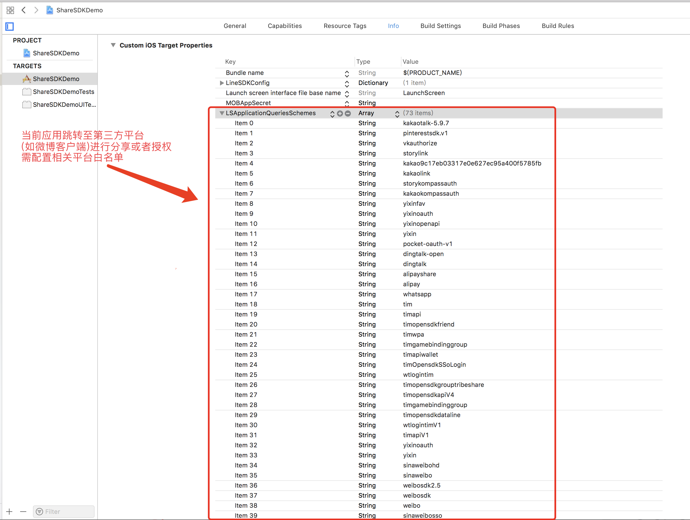
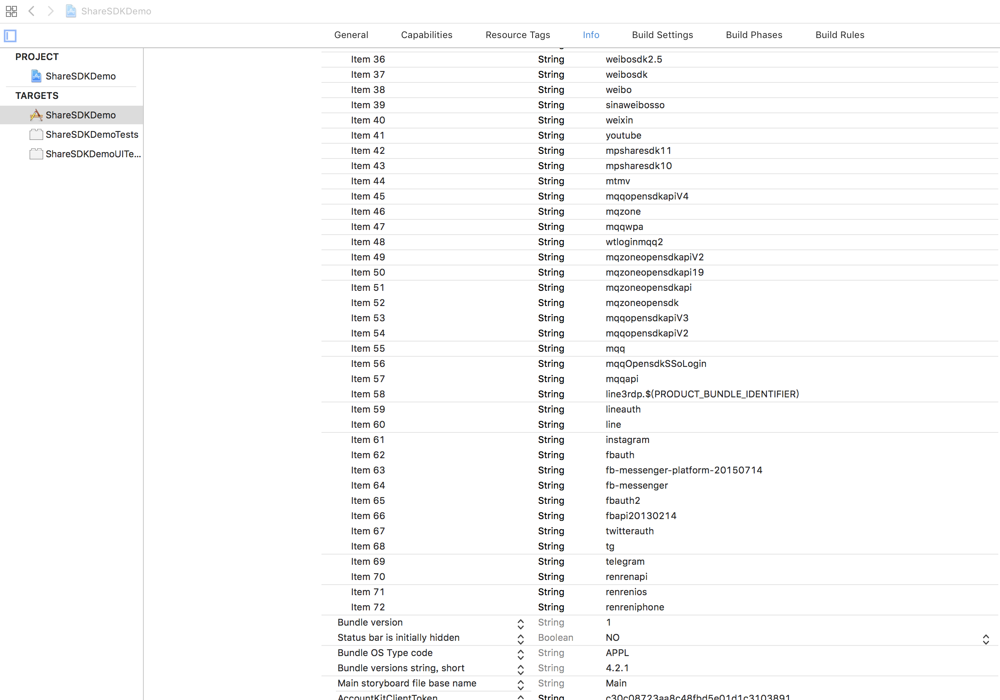

# ShareSDK For iOS
**Document Language :** **[中文](README.md)** | **English**

### Overview
>ShareSDK is a kind of social sharing component for mobile app (Android/iOS). 
ShareSDK supports some convenient interface or framework, and help to easily integrate SNS module feature.
>Main features:
>* Authorize(Third Part Login)
>* Get User Info(such as userid, nickname etc.)
>* Share 

>ShareSDK contains the over 40 platforms,such as:
Sina,WeChat,Tencent QQ,Facebook/FB Messenger,Twitter, Google+, Instagram and many other mainly social platforms.You can always choose the platforms you want.
>We promise that ShareSDK plugin is FREE forever!Welcome to use ShareSDK!

## Installation

### 1.Get MOBAppkey, MOBAppSecret
Please sign up in our website with your email.[Here]() are the steps.
***If you don't understand Chinese, please contact us for help with Skype:appgocn or QQ:4006852216***

### 2.Use the CocoaPods

```
# ============================== START ShareSDK ==============================
# main module(required)
pod 'mob_sharesdk'
 
# UI module(optional,if you need share menu or editor)
pod 'mob_sharesdk/ShareSDKUI'
 
# Social platform  module(only add the platform you need)

pod 'mob_sharesdk/ShareSDKPlatforms/QQ'
pod 'mob_sharesdk/ShareSDKPlatforms/SinaWeibo'
#（Wechat, without Wechat pay）
pod 'mob_sharesdk/ShareSDKPlatforms/WeChat'   
#（Wechat, with full feature include Wechat pay.You can only choose one of Wechat pod)
# pod 'mob_sharesdk/ShareSDKPlatforms/WeChatFull'）
pod 'mob_sharesdk/ShareSDKPlatforms/RenRen'
pod 'mob_sharesdk/ShareSDKPlatforms/AliPaySocial'
pod 'mob_sharesdk/ShareSDKPlatforms/Kakao'
pod 'mob_sharesdk/ShareSDKPlatforms/Yixin'
pod 'mob_sharesdk/ShareSDKPlatforms/Facebook'
pod 'mob_sharesdk/ShareSDKPlatforms/Messenger'
pod 'mob_sharesdk/ShareSDKPlatforms/Copy'
pod 'mob_sharesdk/ShareSDKPlatforms/Evernote'
pod 'mob_sharesdk/ShareSDKPlatforms/GooglePlus'
pod 'mob_sharesdk/ShareSDKPlatforms/Instagram'
pod 'mob_sharesdk/ShareSDKPlatforms/Instapaper'
pod 'mob_sharesdk/ShareSDKPlatforms/Line'
pod 'mob_sharesdk/ShareSDKPlatforms/Mail'
pod 'mob_sharesdk/ShareSDKPlatforms/SMS'
pod 'mob_sharesdk/ShareSDKPlatforms/WhatsApp'
pod 'mob_sharesdk/ShareSDKPlatforms/MeiPai'
pod 'mob_sharesdk/ShareSDKPlatforms/DingTalk'
pod 'mob_sharesdk/ShareSDKPlatforms/YouTube'
pod 'mob_sharesdk/ShareSDKPlatforms/Twitter'
pod 'mob_sharesdk/ShareSDKPlatforms/Dropbox'
pod 'mob_sharesdk/ShareSDKPlatforms/DingTalk'
pod 'mob_sharesdk/ShareSDKPlatforms/CMCC'
pod 'mob_sharesdk/ShareSDKPlatforms/Telegram'
pod 'mob_sharesdk/ShareSDKPlatforms/Reddit'
pod 'mob_sharesdk/ShareSDKPlatforms/DouBan'
pod 'mob_sharesdk/ShareSDKPlatforms/Flickr'
pod 'mob_sharesdk/ShareSDKPlatforms/KaiXin'
pod 'mob_sharesdk/ShareSDKPlatforms/LinkedIn'
pod 'mob_sharesdk/ShareSDKPlatforms/MingDao'
pod 'mob_sharesdk/ShareSDKPlatforms/Pinterest'
pod 'mob_sharesdk/ShareSDKPlatforms/Pocket'
pod 'mob_sharesdk/ShareSDKPlatforms/Print'
pod 'mob_sharesdk/ShareSDKPlatforms/TencentWeibo'
pod 'mob_sharesdk/ShareSDKPlatforms/Tumblr'
pod 'mob_sharesdk/ShareSDKPlatforms/VKontakte'
pod 'mob_sharesdk/ShareSDKPlatforms/YouDaoNote'
pod 'mob_sharesdk/ShareSDKPlatforms/ESurfing'
pod 'mob_sharesdk/ShareSDKPlatforms/FacebookAccount'
pod 'mob_sharesdk/ShareSDKPlatforms/Oasis'
pod 'mob_sharesdk/ShareSDKPlatforms/Apple'
pod 'mob_sharesdk/ShareSDKPlatforms/SnapChat'
 
# Config file share module（optional）
pod 'mob_sharesdk/ShareSDKConfigFile'
 
# Extension module（optional, but required when UI module is used）
pod 'mob_sharesdk/ShareSDKExtension'

# ShareSDKRestore
pod 'mob_sharesdk/ShareSDKRestoreScene'

# ============================== END ShareSDK ==============================
```

### 3.Sometimes you can't search ShareSDK by CocoaPods:
if you `$pod search mob_sharesdk`, and found nothing,you can try this:

1. update pod `$pod setup`
2. clean the pod search index `$rm ~/Library/Caches/CocoaPods/search_index.json`

### 4.Set up your code and config
#### 1) set up your MOBAppKey/MOBAppSecret and init ShareSDK.

We have got MOBAppKey/MOBAppSecret in step 1, then open xcode and set them in the Info.plist of project,like that:

 

**In your xxAppDelegate.m:**
```objc
#import <ShareSDK/ShareSDK.h>
```
Init ShareSDK and set up the platforms' config in the method`- (BOOL)application: didFinishLaunchingWithOptions:`,just like:

```objc
- (BOOL)application:(UIApplication *)application didFinishLaunchingWithOptions:(NSDictionary *)launchOptions
{
    [ShareSDK registPlatforms:^(SSDKRegister *platformsRegister) {
        //QQ
        [platformsRegister setupQQWithAppId:@"100371282" appkey:@"aed9b0303e3ed1e27bae87c33761161d"];
        
        //Wechat
        [platformsRegister setupWeChatWithAppId:@"wx617c77c82218ea2c" appSecret:@"c7253e5289986cf4c4c74d1ccc185fb1"];
        
        //Sina
        [platformsRegister setupSinaWeiboWithAppkey:@"568898243" appSecret:@"38a4f8204cc784f81f9f0daaf31e02e3" redirectUrl:@"http://www.sharesdk.cn"];
        
        //Facebook
        [platformsRegister setupFacebookWithAppkey:@"1412473428822331" appSecret:@"a42f4f3f867dc947b9ed6020c2e93558" displayName:@"shareSDK"];
        
        //Twitter
        [platformsRegister setupTwitterWithKey:@"viOnkeLpHBKs6KXV7MPpeGyzE" secret:@"NJEglQUy2rqZ9Io9FcAU9p17omFqbORknUpRrCDOK46aAbIiey" redirectUrl:@"http://mob.com"];
        //Instagram
        [platformsRegister setupInstagramWithClientId:@"ff68e3216b4f4f989121aa1c2962d058" clientSecret:@"1b2e82f110264869b3505c3fe34e31a1" redirectUrl:@"http://sharesdk.cn"];
        
        //......
        //many other platforms, watch the demo for detail usage
    }];
    return YES;
}
```

#### 2) add your share code

i. import head file
```objc
#import <ShareSDK/ShareSDK.h>
#import <ShareSDKUI/ShareSDK+SSUI.h>
```

ii.Create a share params,and share.
```objc
    // Share by a menu UI
    //1、create share params
    NSArray* imageArray = @[[UIImage imageNamed:@"shareImg.png"]];
    //（image url is supported, such as images:@[@"http://mob.com/Assets/images/logo.png?v=20150320"]）
    NSMutableDictionary *shareParams = [NSMutableDictionary dictionary];
    [shareParams SSDKSetupShareParamsByText:@"Share Text Content"
                                     images:imageArray
                                        url:[NSURL URLWithString:@"http://mob.com"]
                                      title:@"Share Title"
                                       type:SSDKContentTypeAuto];
    //2、Share by menu UI
    [ShareSDK showShareActionSheet:nil
                       customItems:nil
                       shareParams:shareParams
                sheetConfiguration:nil
                    onStateChanged:^(SSDKResponseState state, SSDKPlatformType platformType, NSDictionary *userData, SSDKContentEntity *contentEntity, NSError *error, BOOL end) {
                        switch (state) { 
                            case SSDKResponseStateSuccess:
                            {
                                UIAlertView *alertView = [[UIAlertView alloc] initWithTitle:@"Share Successfully"
                                                                                    message:nil
                                                                                   delegate:nil
                                                                          cancelButtonTitle:@"OK"
                                                                          otherButtonTitles:nil];
                                [alertView show];
                                break;
                            }
                            case SSDKResponseStateFail:
                            {
                                UIAlertView *alert = [[UIAlertView alloc] initWithTitle:@"Share Failed"
                                                                                message:[NSString stringWithFormat:@"%@",error]
                                                                               delegate:nil
                                                                      cancelButtonTitle:@"OK"
                                                                      otherButtonTitles:nil, nil];
                                [alert show];
                                break;
                            }
                            default:
                                break;
                        }
                    }];
                    
    // Share without UI
    //1、create share params
    NSArray* imageArray = @[[UIImage imageNamed:@"shareImg.png"]];
    //（image url is supported, such as images:@[@"http://mob.com/Assets/images/logo.png?v=20150320"]）
    NSMutableDictionary *shareParams = [NSMutableDictionary dictionary];
    [shareParams SSDKSetupShareParamsByText:@"Share Text Content"
                                     images:imageArray
                                        url:[NSURL URLWithString:@"http://mob.com"]
                                      title:@"Share Title"
                                       type:SSDKContentTypeAuto];
    //2、Share 
    SSDKPlatformType platformType = SSDKPlatformTypeSinaWeibo;//Share your target platform, such as Sina
    [ShareSDK share:platformType
         parameters:shareParams
     onStateChanged:^(SSDKResponseState state, NSDictionary *userData, SSDKContentEntity *contentEntity, NSError *error) {
         switch (state) {
             case SSDKResponseStateSuccess:
             {
                 UIAlertView *alertView = [[UIAlertView alloc] initWithTitle:@"Share Successfully"
                                                                     message:nil
                                                                    delegate:nil
                                                           cancelButtonTitle:@"OK"
                                                           otherButtonTitles:nil];
                 [alertView show];
                 break;
             }
             case SSDKResponseStateFail:
             {
                 UIAlertView *alert = [[UIAlertView alloc] initWithTitle:@"Share Failed"
                                                                 message:[NSString stringWithFormat:@"%@",error]
                                                                delegate:nil
                                                       cancelButtonTitle:@"OK"
                                                       otherButtonTitles:nil, nil];
                 [alert show];
                 break;
             }
             default:
                 break;
         }
     }];                                     
```

Above is the basic share feature.What's more,ShareSDK support auth/get-userInfo.Here are the simple method:

```
//Auth
[ShareSDK authorize:platformType
               settings:setting
         onStateChanged:^(SSDKResponseState state, SSDKUser *user, NSError *error) {
             switch (state) {
                 case SSDKResponseStateSuccess:
                 {
                    //login or binding your user system
                     break;
                 }
                 case SSDKResponseStateFail:
                 {
                    //To do failed
                     break;
                 }
                 case SSDKResponseStateCancel:
                 {
                     //To do cancel
                     break;
                 }
                 default:
                     break;
             }
         }];

//Get User Info
[ShareSDK getUserInfo:platformType
           onStateChanged:^(SSDKResponseState state, SSDKUser *user, NSError *error) {
               switch (state) {
                   case SSDKResponseStateSuccess:
                   {
                        //login or binding your user system
                       //or show your userinfo
                       [self showUserInfo:user];
                       break;
                   }
                   case SSDKResponseStateFail:
                   {
                       //to do failed
                       break;
                   }
                       break;
                   case SSDKResponseStateCancel:
                   {
                       // to do cancel
                       break;
                   }
                   default:
                       break;
               }
           }];
```
We couldn't list all the features in this doc. Please run our demo, or check the interface of the frameworks' headers.
***If you need any integration helping, please contact us for help with Skype:appgocn / QQ:4006852216 / Email:support@mob.com***

#### 3) About the URL Schemes and LSApplicationQueriesSchemes
Usually for some social platforms, when we share/auth, we need to jump form our apps to the SNS app such as wechat app, facebook app etc.

**LSApplicationQueriesSchemes**
Here are the configs including all platforms, you can copy from the demo:
  


**URL Schemes** 
Before open a SNS app, we should set up the corresponding URL Scheme, otherwise it's can't return to your app.Different platforms have different rules.
For example:
Wechat:wx+appId, such as:wx617c77c82218ea2c
Facebook:fb+appKey, such as:fb1412473428822331

Example:


Too much platforms to display their ways.Please check the demo for detail.

### Finally
All the mentioned above are the simplest way to use ShareSDK.ShareSDK is always a FREE plugin for all features and all the time.Welcome to use ShareSDK!
***If you need any integration helping, please contact us for help with Skype:appgocn / QQ:4006852216 / Email:support@mob.com***
